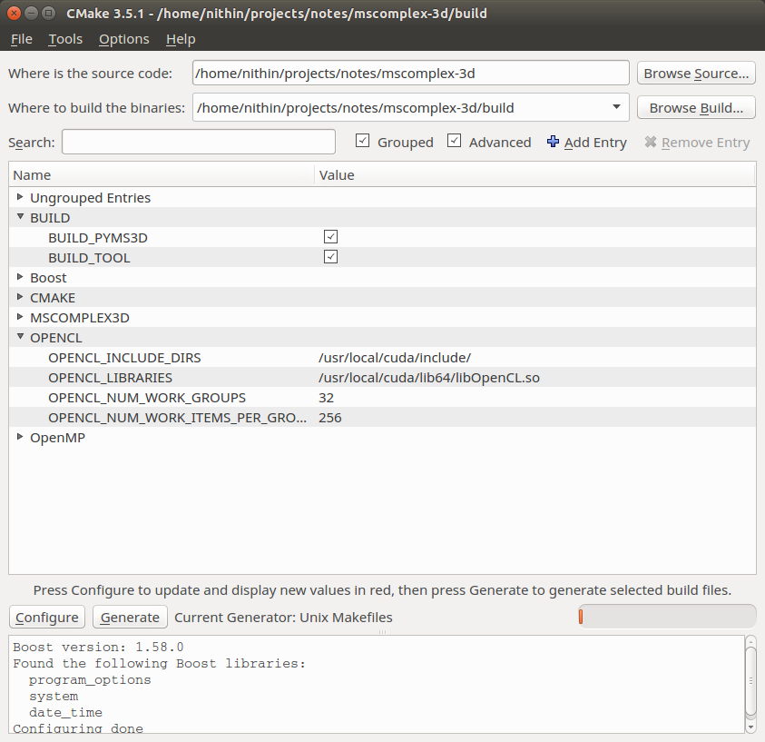

# **mscomplex3d** #

The project page is hosted [here](http://vgl.csa.iisc.ac.in/mscomplex/). More details on what the Morse-Smale complex and the algorithms etc are available on project page. 

The mscomplex3d computes the Morse-Smale complexes on 3d grids. Its available in two modules, either of wich can be used. 

- A python loadable module named **pyms3d**. Use of this module is recommended. See [pyms3d/examples](pyms3d/examples/).
- A command line tool named **mscomplex3d**. This is older and more cumbersome to use.

# Installation #

## Dependancies ##
- [Cmake 3.1.8](http://www.cmake.org/)
- [Boost 1.58](http://www.boost.org/doc/libs/1_58_0/)
- [OpenCL 1.1](https://www.khronos.org/registry/cl/sdk/1.1/docs/man/xhtml/) OpenCL is often tricky to install. See following section for tips. 
- [OpenMP](http://openmp.org/wp/)
- [Python 2.7](http://python.org) with dev libs

## Fetch and Compile (linux) ##


```bash
$ git clone https://bitbucket.org/vgl_iisc/mscomplex-3d.git
$ cd mscomplex3d
$ git submodule update --init --recursive
$ cd ..
$ mkdir build install
$ cd build
$ cmake ../mscomplex-3d/ -DMSCOMPLEX_3D_INSTALL_DIR=../install  -DBUILD_PYMS3D=1  
$ make -j8
$ make -j8 install
```

Run the above commands in bash shell. 

A binary executable named **mscomplex3d** must be present in the install directory. 
A python loadable module named **pyms3d** must be present in the install directory as well as in [pyms3d/examples](pyms3d/examples)

# OpenCL Installation #
Either of the following methods may be used for OpenCL 1.1 installation. 
## OpenCL 1.1 with CUDA (Linux) ##

Nvidia Cuda installs with the default OpenCL version 1.1 (as of Cuda 10.1). Once the drivers are installed (using the cuda .run file) you should find the opencl libs at ```/usr/local/cuda/lib64/libOpenCL.so``` and include directory at ```/usr/local/cuda/include/```. The same must be configured via cmake/cmake-gui. cmake-gui configuration image is shown below. 



## Installing OpenCL (old way) ##

Please follow this guide for installing OpenCL on linux [here](http://wiki.tiker.net/OpenCLHowTo). 

The following is a list of platforms/OSs in which it was necessary to install OpenCL little differently from the above guide. 

- [Asus Zenbook running ubuntu13.10](opencl-on-zenbook)